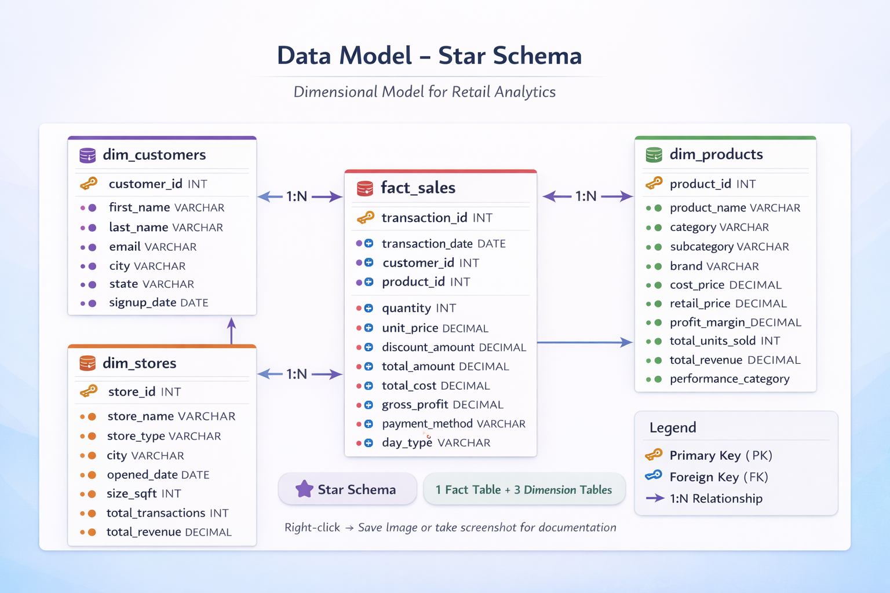

# 🛒 Retail Data Engineering Pipeline

[](https://www.python.org/)
[](https://aws.amazon.com/s3/)
[](https://www.snowflake.com/)
[](https://www.getdbt.com/)
[](https://streamlit.io/)

> A production-ready data engineering pipeline processing 788K+ retail transactions with modern data stack technologies.

## 📊 Dashboard Preview


## 🎯 Project Overview

This end-to-end data pipeline demonstrates:
- **Data Generation**: Realistic retail transaction data using Python & Faker
- **Cloud Storage**: AWS S3 data lake with partitioned structure  
- **Data Warehouse**: Snowflake with dimensional modeling
- **Transformations**: dbt for ELT with staging and analytics layers
- **Visualization**: Interactive Streamlit dashboard with real-time filters

### Key Metrics
- 📦 **788,880** transactions processed
- 👥 **10,000** customers
- 🏪 **50** retail stores
- 📦 **203** unique products
- 💰 **$XX million** in total revenue

## 🏗️ Architecture


### Data Flow
1. **Python** generates synthetic retail data (customers, products, stores, transactions)
2. **AWS S3** stores raw CSV files in date-partitioned structure
3. **Snowflake** loads data into RAW schema via external stage
4. **dbt** transforms data through staging → analytics layers
5. **Streamlit** visualizes insights with interactive dashboard

## 🛠️ Tech Stack

| Component | Technology | Purpose |
|-----------|-----------|---------|
| Language | Python 3.9+ | Data generation & dashboard |
| Cloud Storage | AWS S3 | Data lake for raw files |
| Data Warehouse | Snowflake | Cloud DWH with compute scaling |
| Transformation | dbt | SQL-based ELT framework |
| Orchestration | Manual/Airflow | Pipeline scheduling |
| Visualization | Streamlit + Plotly | Interactive BI dashboard |
| Version Control | Git/GitHub | Source code management |

## 📊 Data Model



### Dimensional Model
- **Fact Table**: `fact_sales` (788K rows)
- **Dimensions**: 
  - `dim_customers` (10K rows) - with lifetime value metrics
  - `dim_products` (203 rows) - with performance categories
  - `dim_stores` (50 rows) - with revenue tiers

## 🚀 Setup & Installation

### Prerequisites
- Python 3.9+
- AWS Account (S3 access)
- Snowflake Trial Account
- Git

### 1. Clone Repository
```bash
git clone https://github.com/yourusername/retail-data-pipeline.git
cd retail-data-pipeline
```

### 2. Environment Setup
```bash
python -m venv venv
source venv/bin/activate  # Windows: venv\Scripts\activate
pip install -r requirements.txt
```

### 3. Configure AWS
```bash
aws configure
# Enter AWS Access Key ID
# Enter AWS Secret Access Key
# Enter region: us-east-1
```

### 4. Generate Data
```bash
python scripts/generate_data.py
```

### 5. Upload to S3
```bash
# Update bucket name in scripts/upload_to_s3.py
python scripts/upload_to_s3.py
```

### 6. Setup Snowflake
```sql
-- Run sql/snowflake_setup.sql in Snowflake worksheet
-- Update AWS credentials and S3 bucket name
```

### 7. Run dbt Transformations
```bash
cd dbt_retail
dbt debug  # Test connection
dbt run    # Run models
dbt test   # Run tests
```

### 8. Launch Dashboard
```bash
# Update .streamlit/secrets.toml with Snowflake credentials
streamlit run dashboard/app.py
```

## 📈 Dashboard Features

- **KPI Cards**: Revenue, transactions, customers, average order value
- **Revenue Trends**: Daily time-series with interactive zoom
- **Category Analysis**: Horizontal bar chart of top categories
- **Product Performance**: Top 10 products by revenue
- **Store Analysis**: Treemap visualization by store type/location
- **Customer Segmentation**: Pie chart of customer segments
- **Loyalty Analysis**: Member vs non-member comparison
- **Temporal Patterns**: Weekday vs weekend sales

## 🎓 Learning Outcomes

This project demonstrates:

✅ **Data Engineering Fundamentals**
- ETL/ELT pipeline design
- Data lake vs data warehouse patterns
- Dimensional modeling (star schema)
- Incremental data loading strategies

✅ **Cloud Technologies**
- AWS S3 storage and organization
- Snowflake compute and storage separation
- Cloud-based data warehousing

✅ **Modern Data Stack**
- dbt for analytics engineering
- Version-controlled transformations
- Documentation and testing

✅ **Business Intelligence**
- Interactive dashboards
- Real-time filtering
- Data storytelling

## 🧩 Project Highlights

### Challenges Overcome
1. **Schema Naming**: Configured dbt to use clean schema names without prefixes
2. **Data Volume**: Optimized queries for 788K+ transaction records
3. **Filter Logic**: Handled empty filter selections gracefully
4. **Connection Management**: Implemented connection pooling and caching

### Design Decisions
- **Star Schema**: Chosen for query performance and business user accessibility
- **Date Partitioning**: Implemented in S3 for efficient incremental loads
- **Materialization Strategy**: Views for staging, tables for marts
- **Caching**: 10-minute TTL on dashboard queries for performance

## 🔮 Future Enhancements

- [ ] Apache Airflow for orchestration
- [ ] Incremental dbt models for large-scale data
- [ ] dbt documentation site deployment
- [ ] CI/CD pipeline with GitHub Actions
- [ ] Data quality monitoring with Great Expectations
- [ ] Real-time streaming with Kafka
- [ ] ML models for sales forecasting
- [ ] Multi-cloud deployment (Azure, GCP)

## 📝 Project Structure
```
retail-data-pipeline/
├── scripts/          # Data generation & upload
├── sql/              # Snowflake setup
├── dbt_retail/       # dbt transformations
├── dashboard/        # Streamlit app
├── docs/             # Documentation & diagrams
└── README.md
```

## 💰 Cost Analysis

- **AWS S3**: ~$0.50/month (<5GB storage)
- **Snowflake**: $0 (trial credits)
- **Total Development**: ~$5 for 3-month project

## 🤝 Contributing

Contributions welcome! Please open an issue or submit a pull request.

## 📄 License

This project is licensed under the MIT License.

---

⭐ If you found this project helpful, please give it a star!
